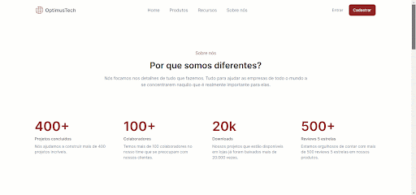
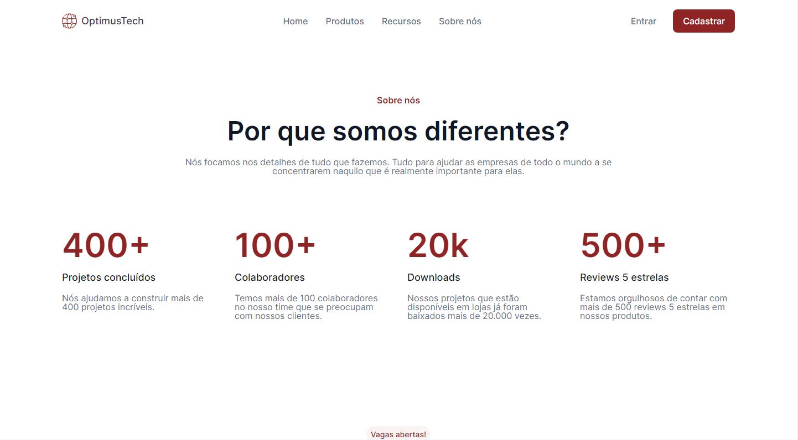
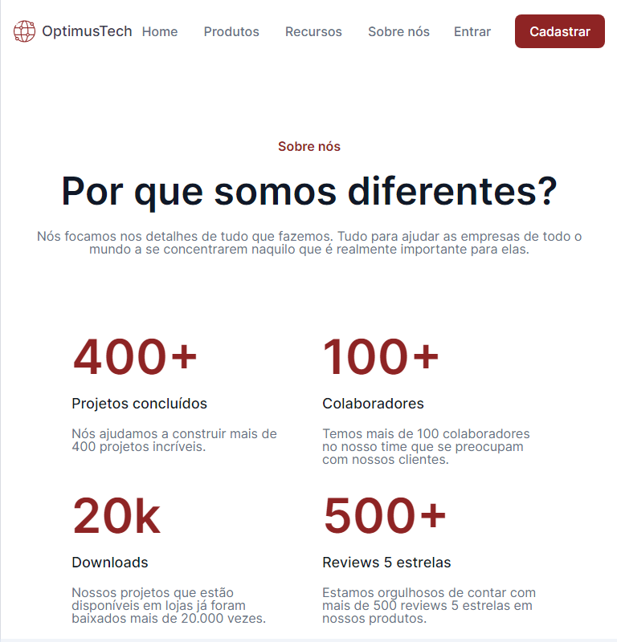
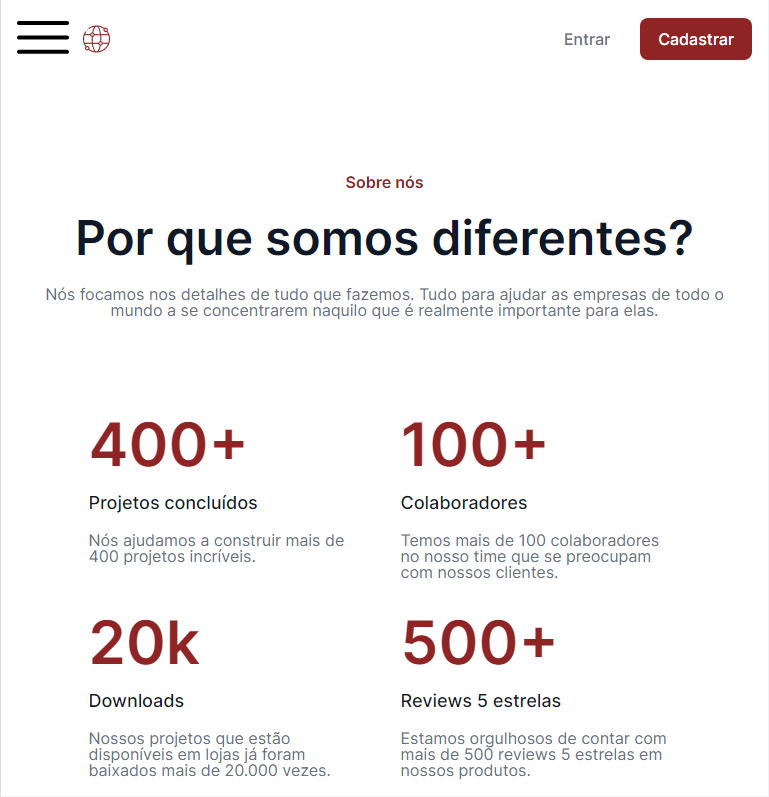
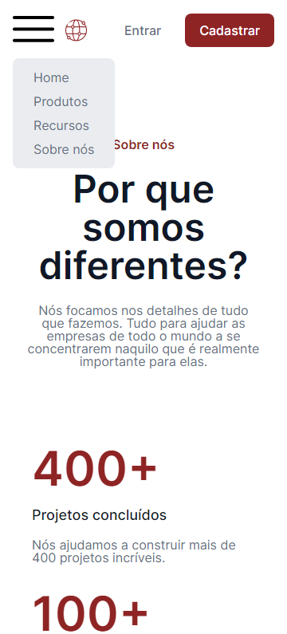

# OptimusTech
### #7DaysOfCode - HTML e CSS

Desafio da alura para criação do site através do design disponibilizado na ferramenta Figma.  
Disponível no Link: [7daysOfCode-HTML-CSS](https://www.figma.com/file/mm3MLozvUDGhDRTxSLlGL5/7daysOfCode-HTML-CSS?type=design&node-id=0-1&mode=design&t=EWHJviLW4qnO0GAh-0)
   
No desafio é proposto a utilização do HTML e CSS puro, optei por utilizar o Scss para ter um código mais limpo com uma melhor manutenção e facilidades de utilizar os mixins e variáveis do Sass.

Este site foi projetado para desktop-first, para deixar ainda melhor optei por deixa-lo responsivo nos tamanhos:  
1440px - Desktop

  
Entre 768px e 997px - Tablet 

  
Menor ou igual a 767px - Mobile  
Com menu hamburguer, funciona bem até o tamanho de 360px  

Mobile 767px 
  

Mobile 360px com menu hambuguer ativo 

